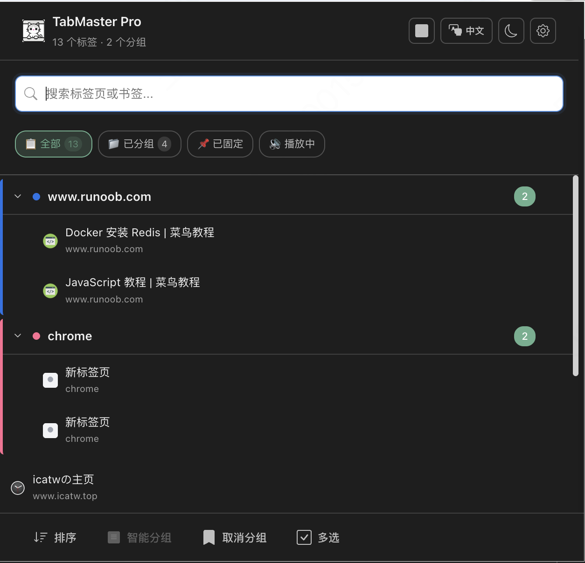
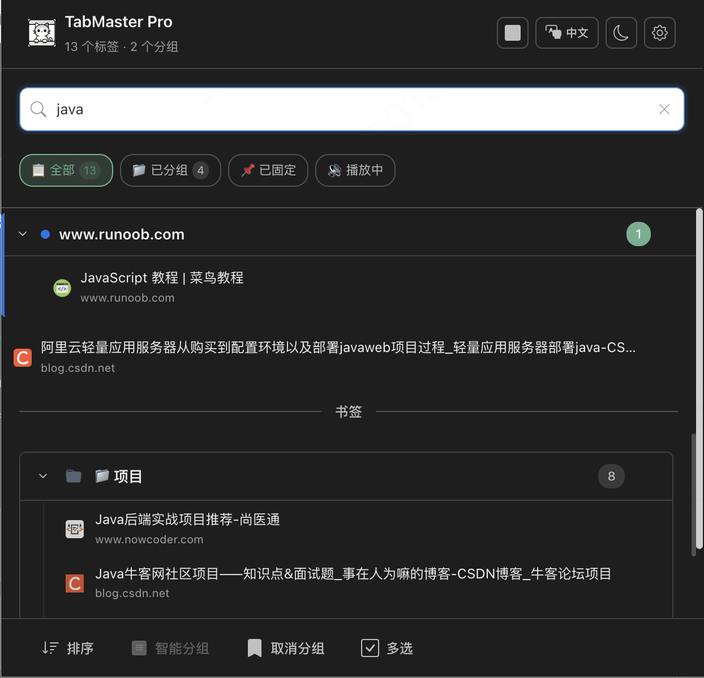
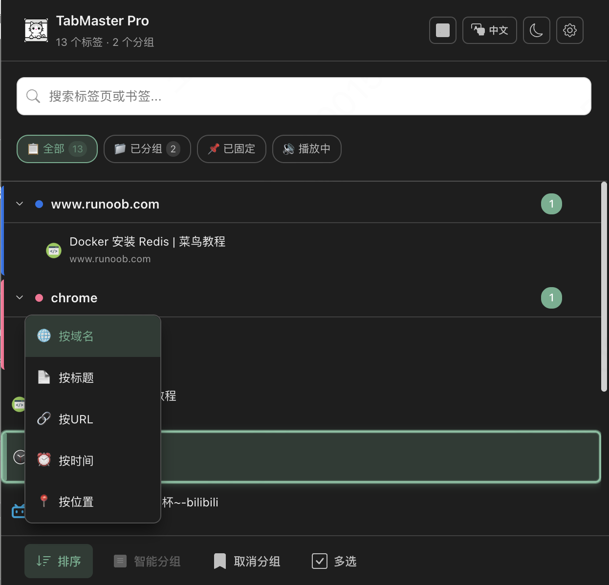
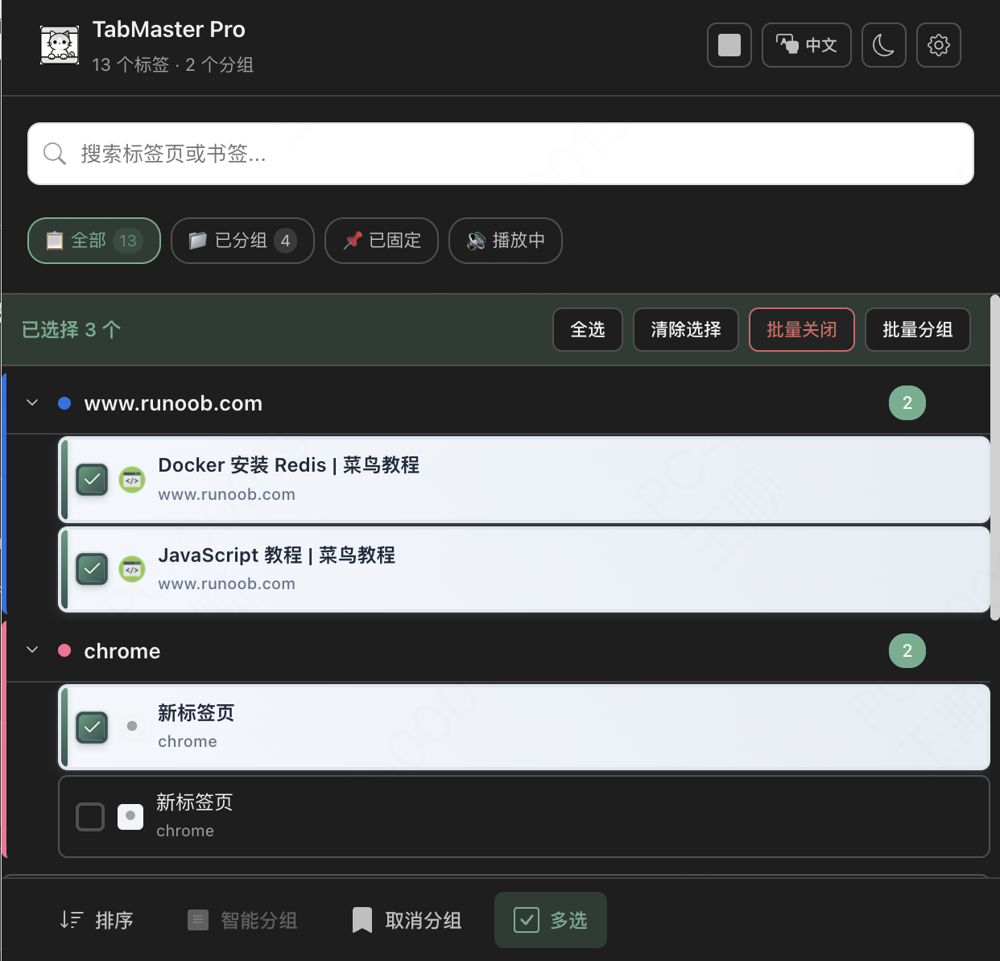
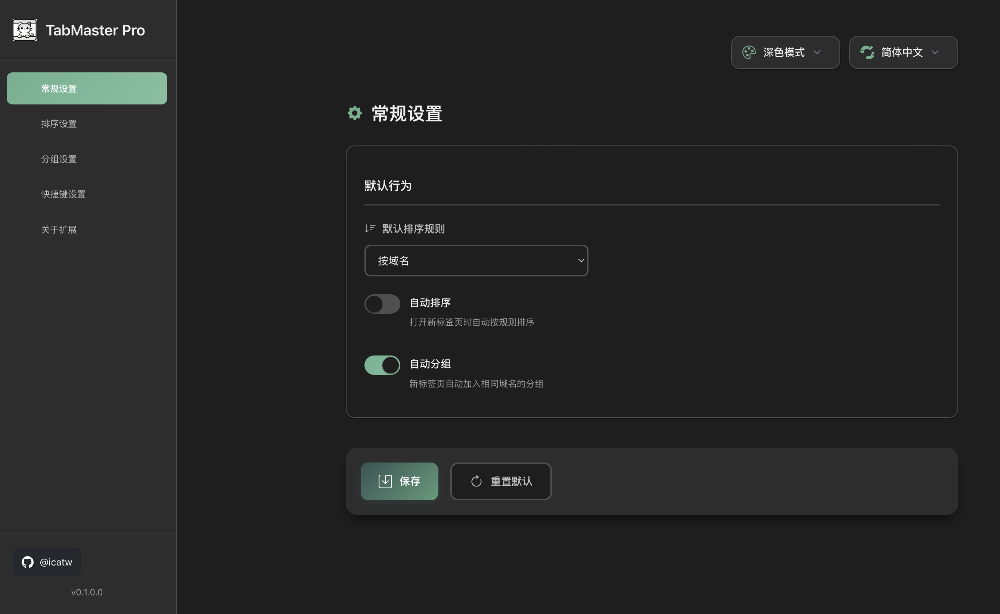
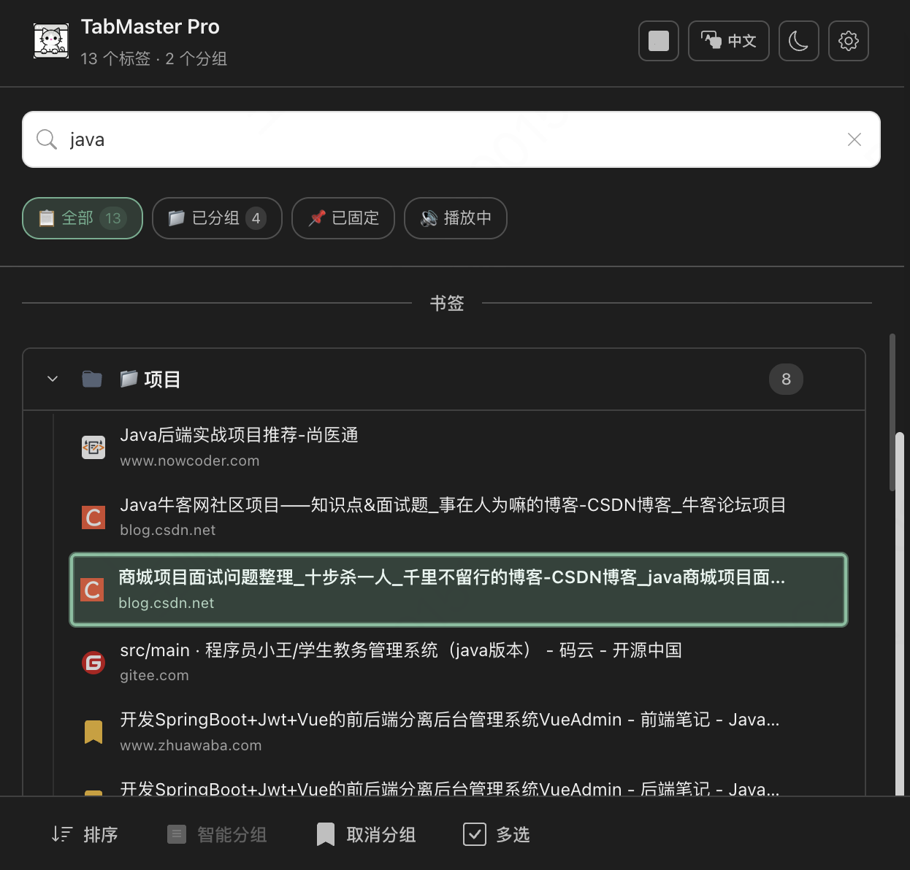

# 🚀 TabMaster Pro

**Professional Tab Management Master**

TabMaster Pro is a modern, efficient Chrome extension designed specifically for professional users to effortlessly master and organize browser tabs. Built with Manifest V3, Vue 3, TypeScript, and Vite, it provides enterprise-grade functionality with a smooth user experience.

[中文文档](./README.md) | **English** | [Report Bug](https://github.com/icatw/TabMaster-Pro/issues) | [Request Feature](https://github.com/icatw/TabMaster-Pro/issues)

## 📸 Application Screenshots

### 🏠 Main Interface
<div align="center">

<br>
<em>Modern tab management interface with dark/light theme support</em>
</div>

<details>
<summary>🖼️ <strong>View More Feature Screenshots</strong></summary>

### 🔍 Smart Search
<div align="center">

<br>
<em>Unified search for tabs and bookmarks with real-time highlighting</em>
</div>

### ⚡ Quick Sort
<div align="center">

<br>
<em>Multi-dimensional sorting options by domain, title, time and more</em>
</div>

### 🎯 Smart Grouping
<div align="center">

<br>
<em>AI-powered smart grouping for automatic tab organization</em>
</div>

### ⚡ Batch Operations
<div align="center">

<br>
<em>Multi-select mode for batch management operations</em>
</div>

### ⚙️ Settings Page
<div align="center">

<br>
<em>Rich personalization and configuration options</em>
</div>

### 🎮 Keyboard Navigation
<div align="center">

<br>
<em>Complete keyboard shortcut operation experience</em>
</div>

</details>

## 💎 Why Choose TabMaster Pro?

TabMaster Pro is more than just a tab management tool—it's your **digital workspace management master**. Whether you're a developer, designer, researcher, or knowledge worker, TabMaster Pro keeps your browser tabs organized and multiplies your productivity.

## ✨ Core Features

### 🔍 Intelligent Search System
- **Unified Search Portal**: Instantly search all open tabs and saved bookmarks in a single search box
- **Smart Highlighting**: Automatically highlights matching keywords in search results for quick target location
- **Real-time Response**: Search as you type, no waiting, instant results

### ⚡ Professional Sorting Engine
- **Multi-dimensional Sorting**: Sort by domain, title, URL, last accessed time, and more
- **Auto-sort**: Configurable intelligent auto-sorting, new tabs automatically arranged by rules
- **One-click Organization**: Hotkey `Ctrl/Cmd+Shift+S` instantly organizes all tabs

### 🎯 Smart Group Management
- **AI Auto-grouping**: Intelligently create tab groups based on domain and content similarity
- **Batch Operations**: Multi-select tabs for batch grouping, closing, or moving
- **Visual Management**: Intuitive grouping interface with drag-and-drop, renaming, and color coding

### 🎮 Full Keyboard Operation
- **Complete Keyboard Navigation**: Arrow keys, Tab, Enter for full keyboard operation
- **Professional Shortcuts**: `Ctrl/Cmd+Shift+G` to group, `Ctrl/Cmd+Shift+U` to ungroup
- **Efficiency First**: Mouse-free operation experience designed for professional users

### 🎨 Modern Interface
- **Dark/Light Themes**: Perfect adaptation to system themes with automatic switching
- **Responsive Design**: Adapts to different screen sizes maintaining optimal visual experience
- **Smooth Animations**: Carefully designed transition animations enhancing operation experience

### ⚙️ Enterprise-grade Configuration
- **Rich Settings**: Comprehensive configuration for sorting rules, grouping strategies, theme preferences
- **Cloud Sync**: Settings automatically sync across devices for seamless work environment switching
- **Import/Export**: Configuration backup and migration support

## 🛠️ Technology Stack

TabMaster Pro adopts modern technology stack ensuring performance, maintainability, and scalability:

- **🎯 Core Framework**: Vue 3 + Composition API - Reactive component architecture
- **💪 Development Language**: TypeScript - Type safety guarantee
- **⚡ Build Tool**: Vite + CRXJS - Lightning-fast development experience
- **🎨 Styling Solution**: UnoCSS - Atomic CSS, generated on-demand
- **📦 State Management**: Pinia - Lightweight state management
- **🔧 Extension Standard**: Manifest V3 - Latest Chrome extension specification
- **🌐 Internationalization**: Vue I18n - Multi-language support
- **🎮 Utility Library**: VueUse - Powerful collection of composable functions

## 📁 Project Architecture

```
tabmaster-pro/
├── 📦 dist/                         # Build output
├── 📂 src/
│   ├── 🎨 assets/                   # Static resources
│   │   ├── icons/                   # App icons
│   │   └── styles/                  # Global styles
│   ├── ⚙️ background/               # Service Worker
│   │   └── service-worker.ts        # Background core logic
│   ├── 🧩 composables/              # Composable functions
│   │   ├── useTabManagement.ts      # Tab management
│   │   ├── useKeyboardNavigation.ts # Keyboard navigation
│   │   └── useTheme.ts              # Theme management
│   ├── 🌍 locales/                  # Internationalization files
│   ├── 🎛️ options/                  # Settings page
│   │   ├── components/              # Settings components
│   │   └── App.vue                  # Settings main app
│   ├── 🚀 popup/                    # Main interface
│   │   ├── components/              # UI components
│   │   └── App.vue                  # Main application
│   └── 📚 shared/                   # Shared code
│       ├── constants/               # Constant definitions
│       ├── types/                   # TypeScript types
│       └── utils/                   # Utility functions
├── ⚙️ Configuration files
│   ├── manifest.config.ts           # Extension configuration
│   ├── vite.config.ts              # Build configuration
│   └── tsconfig.json               # TypeScript configuration
└── 📋 package.json                  # Project dependencies
```

## 🚀 Quick Start

### 📋 Requirements

Ensure your development environment meets the following requirements:

| Tool | Version | Description |
|------|---------|-------------|
| Node.js | `>= 18.0.0` | Recommended LTS version |
| pnpm | `>= 8.0.0` | Recommended package manager |
| Chrome | `>= 100.0` | Manifest V3 support |

### ⚡ Development Setup

#### 1️⃣ Clone Project
```bash
git clone https://github.com/icatw/TabMaster-Pro.git
cd TabMaster-Pro
```

#### 2️⃣ Install Dependencies
```bash
pnpm install
```

#### 3️⃣ Start Development Server
```bash
pnpm dev
```
> 💡 Development server supports hot reload, automatically updates extension after code changes

#### 4️⃣ Load into Chrome Browser
1. Open Chrome and visit `chrome://extensions/`
2. Enable **"Developer mode"** in the top right corner
3. Click **"Load unpacked"**
4. Select the project's `dist` folder

### 📦 Build Production Version

```bash
# Build production version
pnpm build

# Build and package as ZIP
pnpm build:zip
```

After building, the `dist` directory contains publishable extension files.

## 📖 User Guide

### 🎯 Basic Operations

#### Open TabMaster Pro
- Click the TabMaster Pro icon in browser toolbar
- Or use hotkey `Ctrl/Cmd+Shift+T`

#### 🔍 Smart Search
1. Enter keywords in the top search box
2. Real-time display of matching tabs and bookmarks
3. Use arrow keys to navigate, Enter to open

#### ⚡ One-click Sorting
- **Hotkey**: `Ctrl/Cmd+Shift+S`
- **Manual Operation**: Click sort button in bottom toolbar, select sorting rule
- **Auto-sort**: Enable in settings, new tabs automatically arranged

#### 🎯 Smart Grouping
- **Auto-group**: `Ctrl/Cmd+Shift+G` automatically creates groups by domain
- **Manual Grouping**: Multi-select tabs then click group button
- **Ungroup**: `Ctrl/Cmd+Shift+U` dissolves all groups

### 🎮 Advanced Operations

#### Multi-select Tabs
1. Click multi-select mode button (bottom toolbar)
2. Click tabs to select
3. Use batch operations: close, group, move

#### Keyboard Navigation
| Key | Function |
|-----|----------|
| `↑↓` | Navigate tabs |
| `Enter` | Switch to selected tab |
| `Delete` | Close selected tab |
| `Ctrl/Cmd+A` | Select all |
| `Escape` | Clear selection |

#### Group Management
- **Rename**: Double-click group title to edit
- **Collapse**: Click arrow icon before group
- **Color**: Configure group color strategy in settings

### ⚙️ Personalization Settings

Right-click extension icon and select "Options", or click settings button to enter configuration page:

#### Sorting Settings
- Default sorting rule (domain/title/time)
- Auto-sort toggle
- Sort direction (ascending/descending)

#### Grouping Settings
- Auto-grouping strategy
- Minimum tabs per group
- Group color scheme

#### Interface Settings
- Dark/light theme
- Language switching (Chinese/English)
- Interface layout preferences

## 🔧 Development Guide

### 🏗️ Core Architecture

#### Service Worker (`background/service-worker.ts`)
- Extension's core brain, handles all browser API calls
- Manages tab operations, group management, configuration storage
- Communicates with frontend through messaging

#### Composable Functions (`src/composables/`)
- **useTabManagement**: Core tab management logic
- **useKeyboardNavigation**: Keyboard navigation control
- **useTheme**: Theme management and switching
- **useToast**: Message notification system

#### Component Architecture
```
📂 components/
├── 🎛️ layout/          # Layout components
│   ├── AppHeader.vue    # App header
│   ├── SearchSection.vue # Search area
│   └── Toolbar.vue      # Toolbar
├── 📋 common/           # Common components
│   ├── Toast.vue        # Message notification
│   └── LazyComponent.vue # Lazy load component
└── 🎯 business/         # Business components
    ├── TabList.vue      # Tab list
    └── BookmarkList.vue # Bookmark list
```

### 🔄 Communication Mechanism

#### Frontend-Backend Communication
```typescript
// Frontend → Service Worker
const response = await chrome.runtime.sendMessage({
  type: 'SORT_TABS',
  payload: { rule: 'domain' }
})

// Service Worker → Frontend
chrome.runtime.onMessage.addListener((message, sender, sendResponse) => {
  // Handle message
})
```

#### Component Communication
- **Props Down**: Parent component passes data to child component
- **Events Up**: Child component communicates to parent through events
- **Provide/Inject**: Cross-level component communication

### 📋 Development Standards

#### Code Style
- Use ESLint + Prettier to ensure code quality
- Follow Vue 3 Composition API best practices
- TypeScript strict mode ensuring type safety

#### Commit Standards
```bash
feat: new feature
fix: bug fix
docs: documentation update
style: code formatting
refactor: refactoring
test: test related
chore: build process or auxiliary tool changes
```

### 🧪 Testing Strategy

```bash
# Run tests
pnpm test

# Test coverage
pnpm test:coverage

# Test UI
pnpm test:ui
```

## 🗺️ Roadmap

### ✅ Completed
- [x] **Core Architecture** - Manifest V3 + Vue 3 + TypeScript
- [x] **Tab Management** - Sorting, grouping, search functionality
- [x] **User Interface** - Modern UI design
- [x] **Keyboard Navigation** - Complete shortcut support
- [x] **Dark Theme** - Theme switching system
- [x] **Internationalization** - Chinese/English support
- [x] **Configuration System** - Cloud sync settings

### 🚧 In Progress
- [ ] **Performance Optimization** - Large tab handling optimization
- [ ] **Bookmark Management** - Bookmark editing and organization
- [ ] **Tab Preview** - Hover preview functionality

### 🔮 Planned
- [ ] **AI Smart Grouping** - Content-based intelligent grouping
- [ ] **Workspace Management** - Multi-workspace switching
- [ ] **Data Analytics** - Browsing habit analysis
- [ ] **Cloud Backup** - Tab history backup
- [ ] **Team Collaboration** - Share tab collections

## 🤝 Contributing

Welcome to participate in TabMaster Pro development!

### 🐛 Report Issues
- Use [GitHub Issues](https://github.com/icatw/TabMaster-Pro/issues)
- Provide detailed reproduction steps and environment information

### 💡 Feature Suggestions
- Use `enhancement` label in Issues
- Describe use cases and expected effects

### 🔧 Code Contribution
1. Fork the project
2. Create feature branch: `git checkout -b feature/amazing-feature`
3. Commit changes: `git commit -m 'feat: add amazing feature'`
4. Push branch: `git push origin feature/amazing-feature`
5. Open Pull Request

### 📚 Documentation Contribution
- Improve README and code comments
- Write tutorials and best practices

## 📄 License

This project is licensed under the MIT License. See [LICENSE](./LICENSE) file for details.

## 🙏 Acknowledgments

Thanks to the following open source projects and technologies:
- [Vue.js](https://vuejs.org/) - Progressive JavaScript framework
- [Vite](https://vitejs.dev/) - Next generation frontend build tool
- [UnoCSS](https://uno.antfu.me/) - Instant atomic CSS engine
- [CRXJS](https://crxjs.dev/) - Chrome extension development tools

---

<div align="center">

**TabMaster Pro** - Making tab management professional and efficient

[](https://github.com/icatw/TabMaster-Pro)
[](https://chrome.google.com/webstore)

</div>