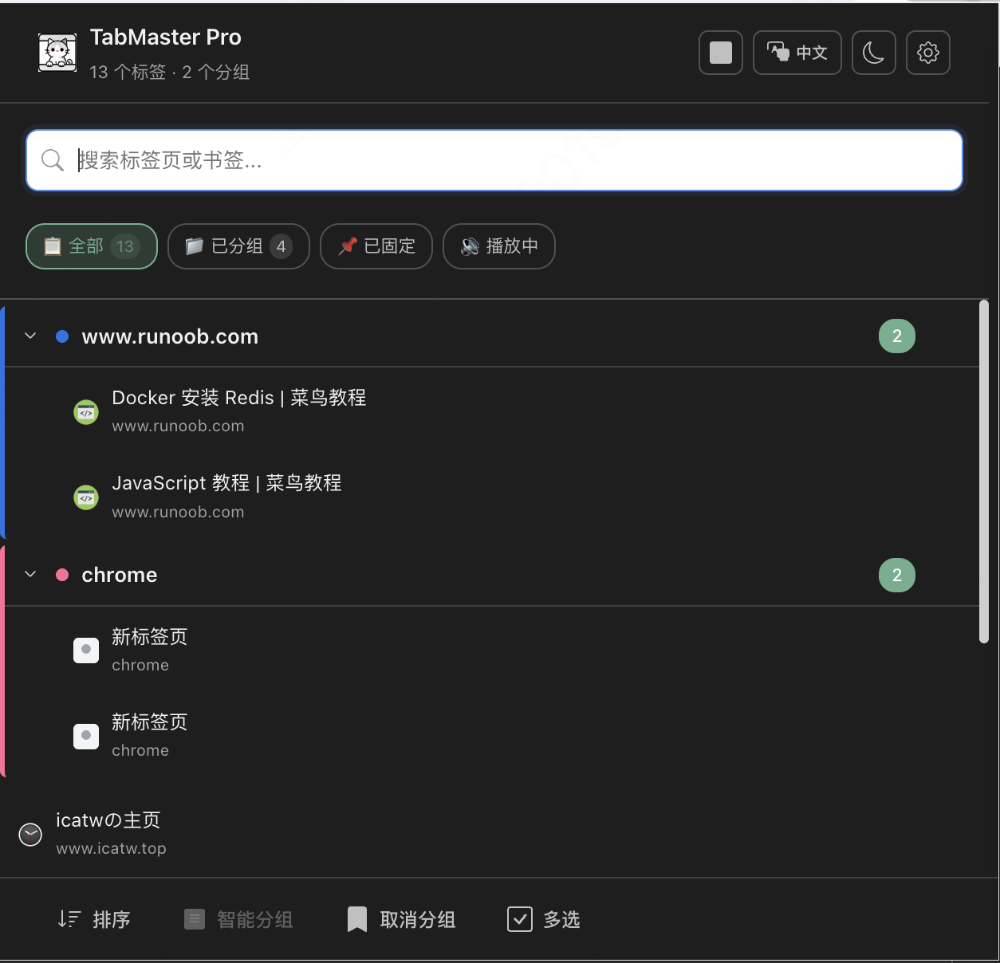
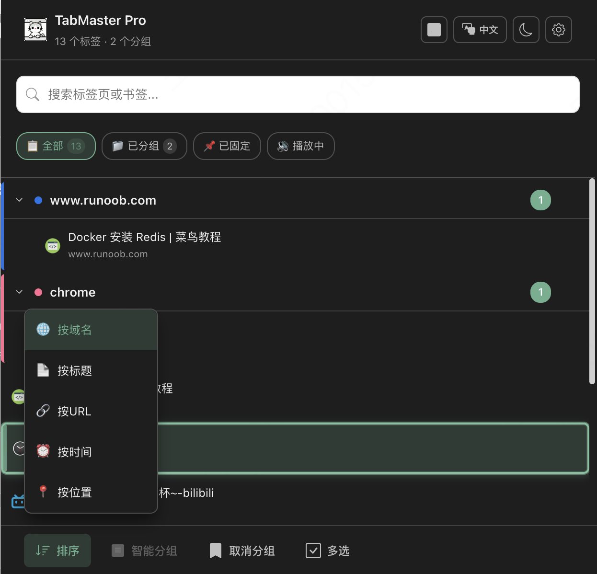
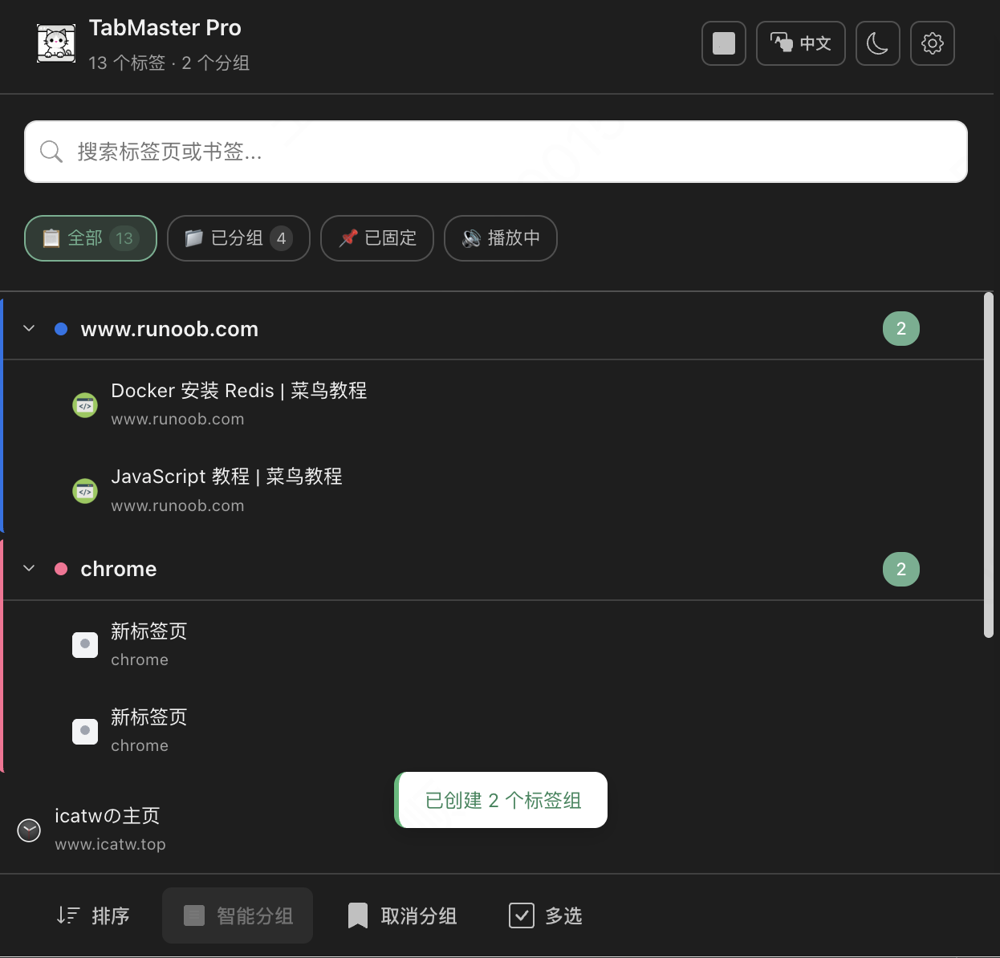
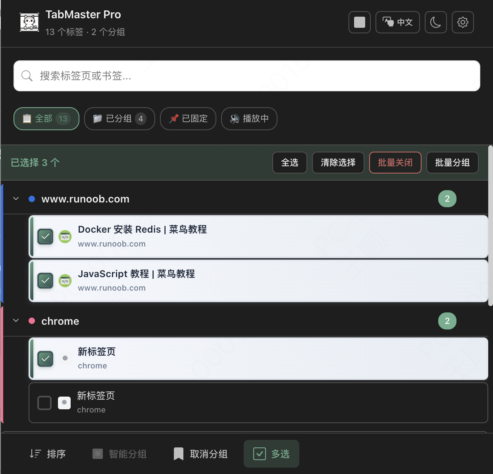
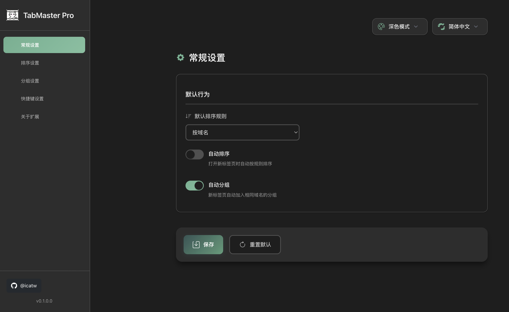
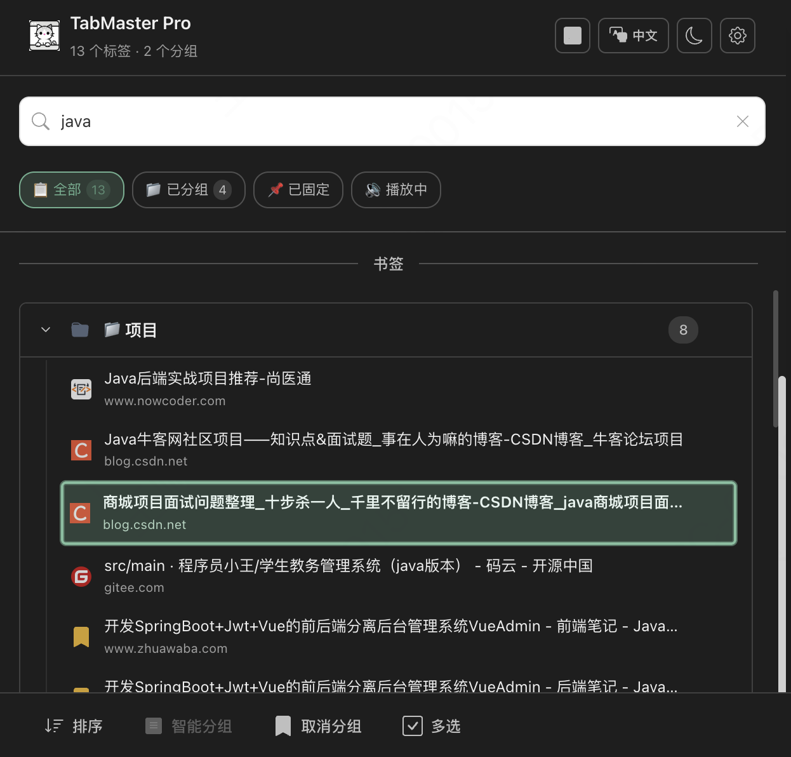

# 🚀 TabMaster Pro

**专业的标签页管理大师**

TabMaster Pro 是一个现代、高效的 Chrome 扩展，专为专业用户打造，帮助您轻松掌控和组织浏览器标签页。基于 Manifest V3、Vue 3、TypeScript 和 Vite 构建，提供企业级的功能和流畅的用户体验。

**中文** | [English](./README.en.md) | [报告问题](https://github.com/icatw/TabMaster-Pro/issues) | [功能建议](https://github.com/icatw/TabMaster-Pro/issues)

## 📸 应用截图

### 🏠 主界面
<div align="center">

<br>
<em>现代化的标签页管理界面，支持深色/浅色主题切换</em>
</div>

<details>
<summary>🖼️ <strong>查看更多功能截图</strong></summary>

### 🔍 智能搜索
<div align="center">

<br>
<em>统一搜索标签页和书签，实时高亮匹配结果</em>
</div>

### ⚡ 快速排序
<div align="center">

<br>
<em>多维度排序选项，支持按域名、标题、时间等规则一键整理</em>
</div>

### 🎯 智能分组
<div align="center">

<br>
<em>AI 驱动的智能分组，自动整理相关标签页</em>
</div>

### ⚡ 批量操作
<div align="center">

<br>
<em>多选模式下的批量管理操作</em>
</div>

### ⚙️ 设置界面
<div align="center">

<br>
<em>丰富的个性化配置选项</em>
</div>

### 🎮 键盘导航
<div align="center">

<br>
<em>完整的键盘快捷键操作体验</em>
</div>

</details>

## 💎 为什么选择 TabMaster Pro？

TabMaster Pro 不仅仅是一个标签管理工具，更是您的**数字工作空间管理大师**。无论您是开发者、设计师、研究员还是知识工作者，TabMaster Pro 都能让您的浏览器标签页井然有序，工作效率倍增。

## ✨ 核心功能

### 🔍 智能搜索系统
- **统一搜索入口**：在单一搜索框中即时查找所有打开的标签页和已保存的书签
- **智能高亮**：搜索结果中自动高亮显示匹配关键词，快速定位目标
- **实时响应**：输入即搜索，无需等待，瞬间获得结果

### ⚡ 专业排序引擎
- **多维度排序**：支持按域名、标题、URL、最后访问时间等多种规则排序
- **自动排序**：可配置的智能自动排序，新标签页自动按规则排列
- **一键整理**：快捷键 `Ctrl/Cmd+Shift+S` 瞬间整理所有标签页

### 🎯 智能分组管理
- **AI 自动分组**：基于域名和内容相似性智能创建标签组
- **批量操作**：多选标签页进行批量分组、关闭或移动
- **可视化管理**：直观的分组界面，支持拖拽、重命名、颜色标记

### 🎮 全键盘操作
- **完整键盘导航**：支持方向键、Tab、Enter 等全键盘操作
- **专业快捷键**：`Ctrl/Cmd+Shift+G` 分组，`Ctrl/Cmd+Shift+U` 取消分组
- **效率优先**：为专业用户设计的无鼠标操作体验

### 🎨 现代化界面
- **深色/浅色主题**：完美适配系统主题，自动切换
- **响应式设计**：适配不同屏幕尺寸，保持最佳视觉体验
- **流畅动画**：精心设计的过渡动画，提升操作体验

### ⚙️ 企业级配置
- **丰富设置项**：排序规则、分组策略、主题偏好等全面可配置
- **云端同步**：设置自动在设备间同步，无缝切换工作环境
- **导入导出**：支持配置备份和迁移

## 🛠️ 技术架构

TabMaster Pro 采用现代化的技术栈，确保性能、可维护性和扩展性：

- **🎯 核心框架**: Vue 3 + Composition API - 响应式组件架构
- **💪 开发语言**: TypeScript - 类型安全保障
- **⚡ 构建工具**: Vite + CRXJS - 极速开发体验
- **🎨 样式方案**: UnoCSS - 原子化CSS，按需生成
- **📦 状态管理**: Pinia - 轻量级状态管理
- **🔧 扩展标准**: Manifest V3 - 最新Chrome扩展规范
- **🌐 国际化**: Vue I18n - 多语言支持
- **🎮 工具库**: VueUse - 强大的组合式函数集合

## 📁 项目架构

```
tabmaster-pro/
├── 📦 dist/                         # 构建输出
├── 📂 src/
│   ├── 🎨 assets/                   # 静态资源
│   │   ├── icons/                   # 应用图标
│   │   └── styles/                  # 全局样式
│   ├── ⚙️ background/               # Service Worker
│   │   └── service-worker.ts        # 后台核心逻辑
│   ├── 🧩 composables/              # 组合式函数
│   │   ├── useTabManagement.ts      # 标签管理
│   │   ├── useKeyboardNavigation.ts # 键盘导航
│   │   └── useTheme.ts              # 主题管理
│   ├── 🌍 locales/                  # 国际化文件
│   ├── 🎛️ options/                  # 设置页面
│   │   ├── components/              # 设置组件
│   │   └── App.vue                  # 设置主应用
│   ├── 🚀 popup/                    # 主界面
│   │   ├── components/              # UI组件
│   │   └── App.vue                  # 主应用
│   └── 📚 shared/                   # 共享代码
│       ├── constants/               # 常量定义
│       ├── types/                   # TypeScript类型
│       └── utils/                   # 工具函数
├── ⚙️ 配置文件
│   ├── manifest.config.ts           # 扩展配置
│   ├── vite.config.ts              # 构建配置
│   └── tsconfig.json               # TypeScript配置
└── 📋 package.json                  # 项目依赖
```

## 🚀 快速开始

### 📋 环境要求

确保您的开发环境满足以下要求：

| 工具 | 版本要求 | 说明 |
|------|----------|------|
| Node.js | `>= 18.0.0` | 推荐使用 LTS 版本 |
| pnpm | `>= 8.0.0` | 推荐包管理器 |
| Chrome | `>= 100.0` | 支持 Manifest V3 |

### ⚡ 开发环境搭建

#### 1️⃣ 克隆项目
```bash
git clone https://github.com/icatw/TabMaster-Pro.git
cd TabMaster-Pro
```

#### 2️⃣ 安装依赖
```bash
pnpm install
```

#### 3️⃣ 启动开发服务器
```bash
pnpm dev
```
> 💡 开发服务器支持热重载，修改代码后自动更新扩展

#### 4️⃣ 加载到 Chrome 浏览器
1. 打开 Chrome，访问 `chrome://extensions/`
2. 开启右上角的 **"开发者模式"**
3. 点击 **"加载已解压的扩展程序"**
4. 选择项目的 `dist` 文件夹

### 📦 构建生产版本

```bash
# 构建生产版本
pnpm build

# 构建并打包为 ZIP
pnpm build:zip
```

构建完成后，`dist` 目录包含可发布的扩展文件。

## 📖 使用指南

### 🎯 基础操作

#### 打开 TabMaster Pro
- 点击浏览器工具栏中的 TabMaster Pro 图标
- 或使用快捷键 `Ctrl/Cmd+Shift+T`

#### 🔍 智能搜索
1. 在顶部搜索框输入关键词
2. 实时显示匹配的标签页和书签
3. 使用方向键导航，回车键打开

#### ⚡ 一键排序
- **快捷键**: `Ctrl/Cmd+Shift+S`
- **手动操作**: 点击底部工具栏的排序按钮，选择排序规则
- **自动排序**: 在设置中启用，新标签页自动排列

#### 🎯 智能分组
- **自动分组**: `Ctrl/Cmd+Shift+G` 按域名自动创建分组
- **手动分组**: 多选标签页后点击分组按钮
- **取消分组**: `Ctrl/Cmd+Shift+U` 解散所有分组

### 🎮 高级操作

#### 多选标签页
1. 点击多选模式按钮（底部工具栏）
2. 点击标签页进行选择
3. 使用批量操作：关闭、分组、移动

#### 键盘导航
| 按键 | 功能 |
|------|------|
| `↑↓` | 导航标签页 |
| `Enter` | 切换到选中标签页 |
| `Delete` | 关闭选中标签页 |
| `Ctrl/Cmd+A` | 全选 |
| `Escape` | 清除选择 |

#### 分组管理
- **重命名**: 双击分组标题编辑
- **折叠**: 点击分组前的箭头图标
- **颜色**: 在设置中配置分组颜色策略

### ⚙️ 个性化设置

右键扩展图标选择"选项"，或点击设置按钮进入配置页面：

#### 排序设置
- 默认排序规则（域名/标题/时间）
- 自动排序开关
- 排序方向（升序/降序）

#### 分组设置
- 自动分组策略
- 最小分组标签数
- 分组颜色方案

#### 界面设置
- 深色/浅色主题
- 语言切换（中文/英文）
- 界面布局偏好

## 🔧 开发指南

### 🏗️ 核心架构

#### Service Worker (`background/service-worker.ts`)
- 扩展的核心大脑，处理所有浏览器 API 调用
- 管理标签页操作、分组管理、配置存储
- 通过消息机制与前端通信

#### 组合式函数 (`src/composables/`)
- **useTabManagement**: 标签页核心管理逻辑
- **useKeyboardNavigation**: 键盘导航控制
- **useTheme**: 主题管理和切换
- **useToast**: 消息提示系统

#### 组件架构
```
📂 components/
├── 🎛️ layout/          # 布局组件
│   ├── AppHeader.vue    # 应用头部
│   ├── SearchSection.vue # 搜索区域
│   └── Toolbar.vue      # 工具栏
├── 📋 common/           # 通用组件
│   ├── Toast.vue        # 消息提示
│   └── LazyComponent.vue # 懒加载组件
└── 🎯 business/         # 业务组件
    ├── TabList.vue      # 标签列表
    └── BookmarkList.vue # 书签列表
```

### 🔄 通信机制

#### 前后端通信
```typescript
// Frontend → Service Worker
const response = await chrome.runtime.sendMessage({
  type: 'SORT_TABS',
  payload: { rule: 'domain' }
})

// Service Worker → Frontend
chrome.runtime.onMessage.addListener((message, sender, sendResponse) => {
  // 处理消息
})
```

#### 组件间通信
- **Props Down**: 父组件传递数据到子组件
- **Events Up**: 子组件通过事件向父组件通信
- **Provide/Inject**: 跨层级组件通信

### 📋 开发规范

#### 代码风格
- 使用 ESLint + Prettier 保证代码质量
- 遵循 Vue 3 Composition API 最佳实践
- TypeScript 严格模式，确保类型安全

#### 提交规范
```bash
feat: 新功能
fix: 修复bug
docs: 文档更新
style: 代码格式调整
refactor: 重构
test: 测试相关
chore: 构建过程或辅助工具的变动
```

### 🧪 测试策略

```bash
# 运行测试
pnpm test

# 测试覆盖率
pnpm test:coverage

# 测试UI
pnpm test:ui
```

## 🗺️ 发展路线

### ✅ 已完成
- [x] **核心架构** - Manifest V3 + Vue 3 + TypeScript
- [x] **标签管理** - 排序、分组、搜索功能
- [x] **用户界面** - 现代化UI设计
- [x] **键盘导航** - 完整的快捷键支持
- [x] **深色主题** - 主题切换系统
- [x] **国际化** - 中英文支持
- [x] **配置系统** - 云端同步设置

### 🚧 进行中
- [ ] **性能优化** - 大量标签页处理优化
- [ ] **书签管理** - 书签编辑和组织功能
- [ ] **标签页预览** - 悬停预览功能

### 🔮 计划中
- [ ] **AI 智能分组** - 基于内容的智能分组
- [ ] **工作区管理** - 多工作区切换
- [ ] **数据分析** - 浏览习惯分析
- [ ] **云端备份** - 标签页历史备份
- [ ] **团队协作** - 分享标签页集合

## 🤝 贡献指南

欢迎参与 TabMaster Pro 的开发！

### 🐛 报告问题
- 使用 [GitHub Issues](https://github.com/icatw/TabMaster-Pro/issues)
- 提供详细的复现步骤和环境信息

### 💡 功能建议
- 在 Issues 中使用 `enhancement` 标签
- 描述使用场景和期望效果

### 🔧 代码贡献
1. Fork 项目
2. 创建功能分支: `git checkout -b feature/amazing-feature`
3. 提交更改: `git commit -m 'feat: add amazing feature'`
4. 推送分支: `git push origin feature/amazing-feature`
5. 开启 Pull Request

### 📚 文档贡献
- 改进 README 和代码注释
- 编写使用教程和最佳实践

## 📄 许可证

本项目采用 MIT 许可证。详情请见 [LICENSE](./LICENSE) 文件。

## 🙏 致谢

感谢以下开源项目和技术：
- [Vue.js](https://vuejs.org/) - 渐进式 JavaScript 框架
- [Vite](https://vitejs.dev/) - 下一代前端构建工具
- [UnoCSS](https://uno.antfu.me/) - 即时原子化 CSS 引擎
- [CRXJS](https://crxjs.dev/) - Chrome 扩展开发工具

---

<div align="center">

**TabMaster Pro** - 让标签页管理变得专业而高效

[](https://github.com/icatw/TabMaster-Pro)
[](https://chrome.google.com/webstore)

</div>